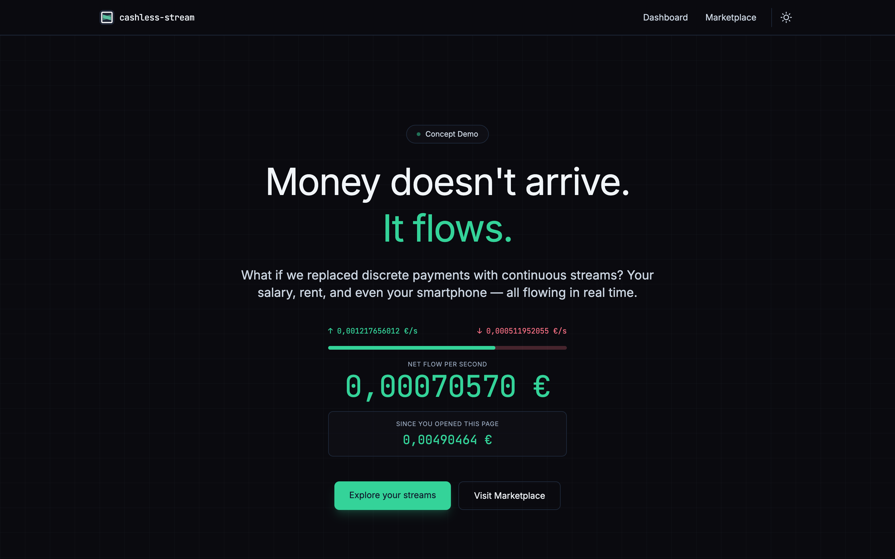
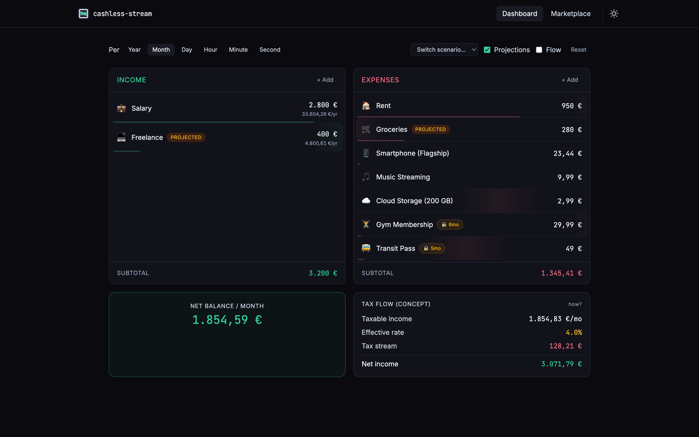
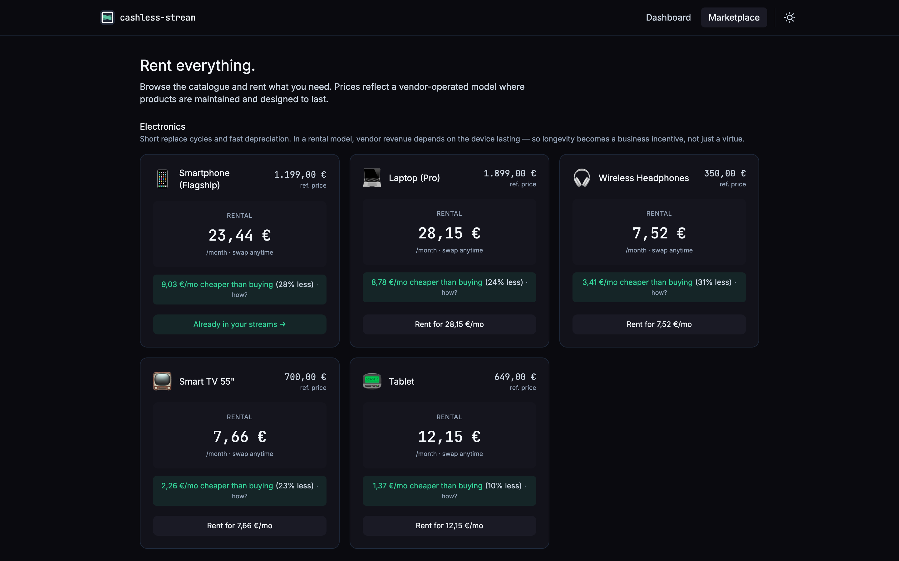

# cashless-stream

> What if money never arrived — it just flowed?

**[→ Live demo](https://cashless-stream.pages.dev)**

A concept demo exploring what a world of **continuous money streams** could look like. Instead of discrete payments — a salary deposited once a month, rent debited on the 1st, a loan repaid in instalments — imagine every financial obligation as a per-second stream, always running, always balanced.

This is a revival of an idea I first sketched out around 2018. Built as a portfolio piece; no backend, no accounts, nothing stored remotely.

---

## The problem with fintech "disruption"

The last two decades gave us a lot of fintech innovation. Mobile payments, digital wallets, open banking, BNPL, neobanks, instant transfers. All genuinely useful. None of it fundamentally changed how money *works*.

The underlying model is the same one we've had for centuries: money moves in discrete chunks, on schedules, with gaps in between. Stripe made accepting card payments trivially easy — but you still get paid monthly. Wise made international transfers cheaper — but you still wait for the payment to land. Revolut gave you a beautiful app — but your salary still arrives as a lump sum on payday.

That's evolution, not revolution. The rails got faster and the UX got better, but the paradigm didn't change.

**What if the paradigm changed?**

---

## The idea

If income and expenses were continuous streams, several things follow naturally:

**No cash gaps.** You're never waiting for payday to cover something that already happened. The structural need for overdrafts, payday loans, and credit card float — products that exist almost entirely to bridge the gap between when money is owed and when it arrives — largely disappears.

**No billing surprises.** Every subscription, utility, and obligation is visible as a live flow. You see your rent, insurance, and groceries draining in real time, not as a sudden debit you forgot was coming.

**Sustainability through transparency.** This one runs deeper than it first appears. When you price a product not as a one-time cost but as a monthly stream over its expected lifetime, longevity becomes legible. A €1,199 phone over 2 years costs €49.96/month. The same phone over 4 years costs €24.98/month — half as much.

This is where planned obsolescence becomes a visible, measurable problem. Since the original iPhone, smartphones have shipped with non-swappable batteries. It's not an engineering necessity — it's a design choice that serves one purpose: shortening the useful life of the device so you buy another. Modern flagships double down on this with increasingly difficult-to-repair screens, proprietary screws, glued components, and software that slows older hardware. Vendors have no financial incentive to make products that last, because longevity is their loss.

In a continuous-stream pricing model, product lifetime is a first-class number. It's right there in the UI. A washing machine from a brand known to last 15 years looks very different next to one that fails in 5, when you're looking at monthly cost rather than sticker price. The Right to Repair movement gets a natural ally: every extra year of life is money saved, continuously, every second.

**Real-time taxation.** Instead of a year-end reconciliation that surprises you with a bill or a refund, tax flows continuously out of your income stream at the effective rate. Predictable, transparent, no surprises.

This isn't a business plan or a technical proposal. It's a bold concept to play with.

---

## What this demo does

Three views to explore the idea:

### Landing
A live counter showing your net earnings per second — right now, while you're reading this. Even before you've opened the dashboard, the concept is already demonstrable.

### Dashboard
Model your finances as streams. Income and expenses are listed with their periodic values, but everything is recalculated continuously and can be viewed at any time granularity — per second, per minute, per hour, per day, per month, per year.

Stream types reflect the reality that not all expenses behave the same way:

- **Live** — a true continuous stream in both directions. Salary flowing in, rent flowing out, an internet subscription ticking away. These are always running.
- **Projected** — expenses that happen discretely but can be modelled as a stream for planning purposes. Groceries, for example: you don't spend €300 uniformly across the month, but treated as a stream it gives you an honest picture of what you're "spending" right now.
- **Bridged** — lump-sum payments (annual insurance, a one-time fee) amortised into a continuous stream. A €350 annual insurance policy becomes €0.97/day. The bridge is the abstraction that turns a discrete event into a flow.

The **accumulator** sits below the streams and shows, since the moment you opened the page, exactly how much you've earned, spent, and netted — updated every animation frame.

### Marketplace
Products priced as monthly subscriptions over their expected lifetime. Browse by category — electronics, appliances, transport, services, charities — and add items to your expense streams. The pricing reflects a vendor-operated rental model where durability is a business incentive, not just a virtue.

---

The thinking behind all of this is in [PHILOSOPHY.md](./PHILOSOPHY.md).

---

## Screenshots







---

## Privacy

No data is sent anywhere. No backend, no analytics, no accounts. State is stored in `localStorage` only — clear your browser data and it's gone.

---

## Stack

- Vue 3 + TypeScript
- Vite 6
- Tailwind CSS 4
- Pinia (state management)
- GSAP (animations)

---

## Running locally

```bash
npm install
npm run dev      # dev server at localhost:5173
npm run build    # production build to dist/
npm run preview  # preview production build
```
